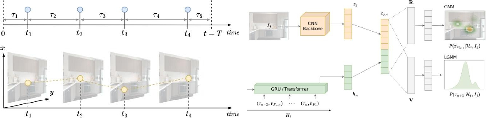

# TPP-Gaze: Modelling Gaze Dynamics in Space and Time with Neural Temporal Point Processes (WACV 2025)
[**Alessandro D'Amelio**](https://scholar.google.it/citations?user=chkawtoAAAAJ&hl=it),
[**Giuseppe Cartella**](https://scholar.google.com/citations?hl=en&user=0sJ4VCcAAAAJ),
[**Vittorio Cuculo**](https://scholar.google.it/citations?user=usEfqxoAAAAJ&hl=it&oi=ao),
[**Manuele Lucchi**](https://github.com/manuelelucchi),
[**Marcella Cornia**](https://scholar.google.com/citations?hl=en&user=DzgmSJEAAAAJ),
[**Rita Cucchiara**](https://scholar.google.com/citations?hl=en&user=OM3sZEoAAAAJ)
[**Giuseppe Boccignone**](https://scholar.google.it/citations?user=LqM0uJwAAAAJ&hl=it&oi=ao),


[]()
[]()

This is the **official repository** for the [**paper**]() "*TPP-Gaze: Modelling Gaze Dynamics in Space and Time with Neural Temporal Point Processes*".

## Overview

<p align="center">
    
</p>

>**Abstract**: <br>
> Attention guides our gaze to fixate the proper location of the scene and holds it in that location for the deserved amount of time given current processing demands, before shifting to the next one. As such, gaze deployment crucially is a temporal process. Existing computational models have made significant strides in predicting spatial aspects of observer's visual scanpaths (***where*** to look), while often putting on the background the temporal facet of attention dynamics (***when***). In this paper we present \tppgaze, a novel and principled approach to model scanpath dynamics based on Neural Temporal Point Process (TPP), that jointly learns the temporal dynamics of fixations position and duration, integrating deep learning methodologies with point process theory. We conduct extensive experiments across five publicly available datasets. Our results show the overall superior performance of the proposed model compared to state-of-the-art approaches.

## Citation
If you make use of our work, please cite our paper:

```bibtex
@inproceedings{damelio2025tppgaze,
  title={TPP-Gaze: Modelling Gaze Dynamics in Space and Time with Neural Temporal Point Processes},
  author={D'Amelio, Alessandro and Cartella, Giuseppe and Cuculo, Vittorio and Lucchi, Manuele and Cornia, Marcella and Cucchiara, Rita and Boccignone, Giuseppe},
  booktitle={Proceedings of the IEEE/CVF Winter Conference on Applications of Computer Vision},
  year={2025}
}
```

# Code coming soon...